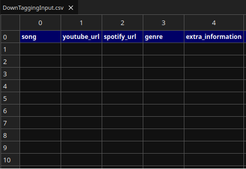
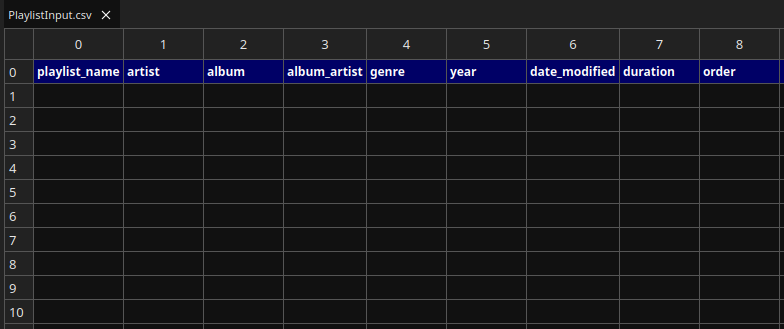

# **Mp3DownTagger**

## Table of contents
1. [About Mp3DownTagger](#about-mp3downtagger)
2. [Installation](#installation)
3. [Usage](#usage)
4. [Recommended music players](#recommended-music-players)
5. [Ways of synchronizing the music between your computer and your mobile phone](#ways-of-synchronizing-the-music-between-your-computer-and-your-mobile-phone)
6. [Customizable fields of configuration file](#customizable-fields-of-configuration-file)
7. [General notes](#general-notes)
8. [Languages](#languages)
9. [License](#license)

## About Mp3DownTagger

Mp3DownTagger is a music downloader and tagger program that is also capable of creating playlists with powerful filters. There are multiple programs available for listening to music, these are streaming platforms such as Spotify or Amazon Music, or tons of downloaders and music players that allow the final user to filter music and create playlists. However, none of the programs that I ever tried check all of these boxes:

- Free software. You don't have to pay a subscription for a product that will never be yours.
- Open-source software free of spyware.
- The possibility of downloading songs at once, not matter how many of them you want to download. In all of the software that I have ever tried, to download content you have to paste one link, download the specific item and after that, paste the next link and do the same. In this program, it is possible to paste any number of links and download all of them by running the program only once.
- The possibility of tagging each downloaded song using a manual mode to control the final tagging result or also using an automated mode that produces accurate results.
- The user is able to insert any genre that they consider for each song. Afterwards, they can create playlists based on this tag.
- 3 modes of downloading and tagging music:
    - Download and tag music.
    - Only download music.
    - Tag existing songs.
- Powerful filters to filter music recursively when creating playlists. Normally, when you filter music in video players or in streaming platforms you are only allowed to filter by artist, album, year, an so forth. However, you can't apply more advanced and specific filters like the following examples:
    - Select songs whose artists are David Guetta, Martin Garrix and Daddy Yankee, the release date is between 2010 and 2012 as well as between 2015 and 2020, and the duration of songs is greater than 6 minutes or less than 4 minutes.  
    Firstly sort songs by genre, secondly sort each song with the same genre by year and thirdly sort each song with same genre and year by album.
    - Select songs whose album artists are Danny Romero, Aventura and Kygo, the genre is bachata or electronic, and their added date is from 06/2023 to 08/2023 as well as from 06/2024 to 08/2024 (the last two summers).  
    Shuffle the produced playlist.

This program not only helps you download music quickly, but also create playlists with the songs you precisely want depending on your current mood. This is very helpful, especially when you have a large number of songs on a device and it is hard to find them without applying such advanced filters.

## Installation

To install this program follow the next steps depending on what operating system you are running:

- GNU/Linux.
    - Clone this respository.
    - Run the Linux install script with **NON-SUDO** privileges. This will place the program in /opt/Mp3DownTagger directory, the log file in /var/log/Mp3DownTagger and two input csv files as well as a soft link to the config.json file in ~/Music/Mp3DownTagger. It will also add this program to the PATH and install some of the programs mentioned a few lines below.
    - Delete the folder in which is cloned the repository in order to avoid problems in the future when updating.
    - Run the update script, in the installation folder, with **NON-SUDO** privileges when a new version is released to update the program.

- Microsoft Windows.
    - Download and install Git if it is not already installed. Go to https://git-scm.com/, click on the Downloads section, and select Windows. Afterwards, when running the installer, do not change the default options already marked.
    - Clone this respository or download it by pressing the "<> Code" button and "Download ZIP" option.
    - Open up a Git Bash terminal as administrator and use the terminal to go to the folder where you just cloned/downloaded the Mp3DownTagger repository. Then, go to the Mp3DownTagger folder, and afterwards to the Installer/Microsoft Windows/ directory. To browse through the folders you have to use the cd command, that is to say, to type the following: cd folder_name.
    - Run the install_1.sh script by typing the following: ./install_1.sh
    - With **ANOTHER** elevated Git Bash terminal follow the same steps and run the install_2.sh script.
    - Open up a Powershell terminal as administrator and use the terminal to go to the folder where you just cloned/downloaded the Mp3DownTagger repository. Then, go to the Mp3DownTagger folder, and afterwards to the Installer/Microsoft Windows/ directory. To browse through the folders you have to use the cd command and type the following: cd folder_name.
    - Run the install.ps1 script by typing the following: Invoke-Expression (Get-Content .\install.ps1 -Raw). If for some reason it doesn't work, open the script with a text editor, copy all the commands and paste them on the terminal. You can copy the commands one by one or all of them at once.
    - Delete the folder in which is cloned the repository in order to avoid problems in the future when updating.
    - Run update scripts, in the installation folder (firstly update.sh and afterwards update.ps1), when a new version is released to update the program. The first one has to be run with an elevated Git Bash terminal, and the second one must be run with an elevated Powershell terminal typing the following: Invoke-Expression (Get-Content .\update.ps1 -Raw). If for some reason the second script doesn't work, open the script with a text editor, copy all the commands and paste them on the terminal. You can copy the commands one by one or all of them at once.

- Mac OS.   Coming soon...

To run this program and take advantage of all of its features, a few programs must be installed. If for some reason, the install script doesn't install them for you, they are the following ones:

- [NodeJS](https://nodejs.org/en/download/package-manager) along with NPM, its package manager.
- [Git](https://git-scm.com/downloads).
- [MegaSync](https://mega.io/desktop#download) (recommended).
- [Modern CSV](https://www.moderncsv.com/download/) (recommended).

This program has a default configuration file "config.json" with a few parameters set. Feel free to analyze it and change any configuration you desire in order for you to use this program in a better way. Depending on what operating system you are running, the config.json file can be accessed through a symbolic link from the following directories:

- GNU/Linux. ~/Music/Mp3Downtagger
- Microsoft Windows. Music\\\\Mp3Downtagger
- Mac OS.

Apart from installing the above programs, if you want to run this program in automated mode, which is the most convinient way of making the most of it, you must create a spotify account and configuring it in order to use its API from this program. This can be done following the next steps:

- Create a spotify account.
- Go to [Spotify for Developers](https://developer.spotify.com/) website.
- Go to Dashboard section.
- Select Create app.
- Type a random name and description. In the Redirect URI's field type "https://example.org/callback".
- Click on Save.
- Go back to Dashboard and select the app you have just created.
- Click on settings and copy the client ID and client secret data to the corresponding configuration fields on the config.json file.

## Usage

As mentioned before, this program has two main functionalities, the downtag mode and the playlist mode. To display it on a terminal type the following command:

    ❯ Mp3DownTagger -help

    Mp3DownTagger 1.0.0. A music downloader and tagger program that is also capable of creating playlists with powerful filters.

    Usage: Mp3DownTagger [OPTION]

    -downtag        Download and tag new songs, simply download, or simply tag an existing song.
    -playlist       Create a playlist applying powerful filters.
    -help           Print this help.

For the above functionalities to work, the fields of a csv file must be completed. This csv file can be either DownTagInput.csv or PlaylistInput.csv depending on what mode you want to run this program. A pretty good program to work with this files is ModernCSV, that's why it is recommended to install it before.

### Downtag mode

You have to provide some information of each song you want to download or tag to the program. Open the DownTagInput.csv and depending on what you want to do in this mode you should fill in one field or another. An empty example of this file is shown below.

#### Download and tag music

##### Manual mode

In this first scenario, you must fill in at least the next fields:

- song. This will be the name of the mp3 file that will be downloaded as well as its title tag.

- youtube_url. The youtube url of the previous song must be placed here.

- spotify_url. The corresponding spotify url of the song you provide goes here.

- genre (optional). It will give you the possibility of tagging the genre field of the mp3 file with the custom genre you choose.

##### Automated mode

This mode is equivalent to the previous one except for one thing. The next fields must be filled in or changed:

- spotify_url. You have to type "auto" instead of a specific link to tell the program to search for the song automatically on Spotify.

- extra_information. This field is not mandatory as such, but it will help the program give you much more accurate results. Here you can type the name of multiple artists separated by comma to help the program identify uniquely a song and give you the result you want.

#### Download music

In this second scenario, you must fill in the next fields:

- song (optional). This will be the name of the mp3 file that will be downloaded. If this field is not filled in, the mp3 file will have the name of the youtube video title. In order to prevent problems with the file system rules, it is recommended to fill in this field to avoid unexpected characters that are present in some video titles.

- youtube_url. The youtube url of the previous song must be placed here.

#### Tag existing music

##### Manual mode

In this third scenario, you must fill in the next fields:

- song. This will be the name of the mp3 file that will be tagged.

- spotify_url. The corresponding spotify url of the song you provide goes here.

- genre (optional). It will give you the possibility of tagging the genre field of the mp3 file with a custom genre you choose.

##### Automated mode

This mode is equivalent to the previous one except for one thing. The next fields must be filled in or changed:

- spotify_url. You have to type "auto" instead of a specific link to tell the program to search for the song automatically on Spotify.

- extra_information. This field is not mandatory as such, but it will help the program give you much more accurate results. Here you can type the name of multiple artists separated by comma to help the program identify uniquely a song and give you the result you want.

NOTES:
- For automated mode to be run you need to have a Spotify account and follow the steps explained in the Installation section.
- It is not necessary to specify the mp3 extension on the song field.
- You can run the three downtag modes at once. That is to say, you can download and tag x songs, download y songs and tag z existing songs simultaneously.
- This mode works properly at the time of this release. However, if Spotify decides to change the way it represents information, this program may not work again until the corresponding adaptations are applied. Therefore, if you cannot use this program because none of the songs you download can be tagged, just open an Issue and I will adapt the code as soon as possible, so the program can work properly again.
- Spotify represents some albums in a non-standard way. That implies that these "non-common" albums may not be able to be tagged 100 % accurately. To be more precise, the artist field is the one that will not be tagged correctly. Fortunately, this is not a common behaviour with the majority of the songs I have tested.
- This program depends on a few public libraries to download and tag music. This means that if these public libraries have errors in the future, this program may not work as expected. If this happens, I will try to find a solution as soon as possible to make the program work properly again.
- This program needs exact matches to find songs. Therefore, be careful when typing. Accents, multiple white spaces and some special characters such as "-", "(", ")", "[", or "]" are removed when searching for songs in Spotify to increase accuracy.
- It is worth mentioning that sometimes there are TIMEOUT errors when requesting data to Spotify. I haven't discovered the reason for this problem yet, but I have implemented a temporary solution that works almost always. I will try to find out why this happens and solve this issue as soon as possible. If you run into this TIMEOUT error, comment/remove the songs that have already been completed from the DownTagInput.csv file and rerun the program as many times as necessary to complete the other ones. 

### Playlist mode

You have to provide some information of each playlist you want to create to the program. Open the PlaylistInput.csv and depending on what you want to do in this mode you should fill in one field or another. An empty example of this file is shown below.

In this scenario, you must fill in some of the next fields:

- playlist_name. The playlist name must added here. If this is not provided, a default customizable name will be used. That is "Playlist 1, Playlist 2, etc".

- artist. In this field you must type all the artists who you want to appear in your playlist.

- album. The names of the albums that you want to appear in your playlist go here.

- album_artist. This field is different from the artist field. This one is for the artists who own an album whereas the other one is for all the artists who are present in a song.

- genre. All the genres that you want to appear in your playlist go here.

- year. This is the release date of a song. This field can be one single year, various years or intervals of years with **NO SPACES** between them. Valid inputs would be:
    - 2010\. Songs with 2010 as release date.
    - 2010,2015,2020. Songs with 2010, 2015 and 2020 as release dates.
    - 2010-2015. Songs with release dates between 2010 and 2015.
    - 2010,2015,2017-2020. Songs with 2010, 2015 as relase dates as well as release dates beween 2017 and 2020.

- date_modified. This stands for the addition date for each mp3 file. As operating systems save this date accurately, you can also filter by month. The format is the same as the previous field, i.e. with **NO SPACES** between them and with the addition of the months searching capability. Valid inputs would be.
    - 2010\. Songs with 2010 as addition date.
    - 2010,2015,2020. Songs with 2010, 2015 and 2020 as addition dates.
    - 2010-2015. Songs with addition dates between 2010 and 2015.
    - 2010,2015,2017-2020. Songs with 2010, 2015 as addition dates as well as addition dates beween 2017 and 2020.
    - 06/2024-08/2024. Songs with addition dates between 06/2024 and 08/2024 (both monts included). That is to say, the summer of 2024.
    - 06/2023-08/2023, 06/2024-08/2024. Songs with addition dates of the summer of 2023, and the summer of 2024.

- Duration. This field aims at filtering the short songs or the large ones. Valid inputs with **NO SPACES** would be:
    - 7\. Songs with a duration of 7 minutes.
    - 5-6. Songs with a duration between 5 and 6 minutes (both included).
    - 7,5-6. Songs with a duration of 7 minutes as well as songs with a duration between 5 and 6 minutes (both included).

- order. The playlist that is generated with the previous filters can also be sorted recursively by all the same filters. Valid values for this field are "artist", "album", "album_artist", "genre", "year", "date_modified", "duration" and "shuffle" and valid inputs with **NO SPACES** for this field would be:
    - genre. Sort songs by genre.
    - genre,year. Firstly sort songs by genre, secondly sort each song with the same genre by year.
    - genre,year,album. Firstly sort songs by genre, secondly sort each song with the same genre by year and thirdly sort each song with same genre and year by album.
    - shuflle. Randomize the playlist.

With the default configuration, this creates two playlists. One that can be run on a computer and another than can be run on a mobile phone by importing it on a music player. The name of the last one will end by " - Phone". This name can be changed on the config file. If you haven't changed the default settings on the config.json file, these playlist files will be located on the Music directory of the computer, specifically on the Playlist directory and you just have to place the adapted to the phone playlist file on the music phone directory.

NOTES:
- If you want to enter multiple data in a specific field, it must be separated with commas.
- Ordering a playlist and suffling it afterwards does not make sense.

## Recommended music players

### Computer

For computers, I really encourage you to use [VLC](https://www.videolan.org/). It is an open-source multiplatform program and also the most advanced video player I have ever tried.

### Mobile phones

For mobile phones, there is also a VLC version available. Its performance is much better than other music players, however I don't like its interface so much. 
Another alternative is a music player called Musicolet, which has many features available, but it is not that intuitive. 
There are also music players that are installed by default on each mobile phone depending on their brand, some of them are very good and have the possibility of importing external playlist. You need a music player that allows you to import external playlist, that's all you need to care about.

## Ways of synchronizing the music between your computer and your mobile phone

What I do to copy the music from the computer to the mobile phone without pluging it via USB is to have my Music folder auto synchronized with [Mega](https://mega.io/) cloud. In this way, each time a new song is downloaded, i.e. added to the Music folder, it will be uploaded to this cloud service. There are multiple cloud storage services out there, however I consider that Mega is a pretty good one. If you don't like it, I encourage you to do a research to find the most appropriate software for you.

After uploading automatically each song to the cloud, the final step would be downloading them into the mobile phone. To do this, you have two options:

- Manual download. You would need to download the official mobile app of the cloud service you choose. Because of the aforementioned auto-synchronize capabilities, each time you download a new song to your computer it will be instantly available for you to download it from the chosen service's cloud to the mobile phone as well.
- Automated synchronization. There are only a few mobile applications that offer automated synchronization, after doing a research, the best programs I found are FolderSync and MegaSync. All you have to do is configuring a remote folder, a local folder and the way of synchronizing the data between both folders. I use "from remote folder to local folder" way of synchronization.  
Despite their good features, sometimes they don't work as expected, they use an enormous amount of mobile data, and they also drain quickly the battery. Furthermore, some music players are not able to see the new songs immediately, altough this doesn't happen to VLC music player. Therefore, it's up to you to decide whether you want to use an autosync application or not. I also encourage you to do a research and find another possible application to do this.

## Customizable fields of configuration file

Depending on what operating system you are running, the config.json file can be accessed through a symbolic link from the following directories:

- GNU/Linux. ~/Music/Mp3Downtagger
- Microsoft Windows. Music\\\\Mp3Downtagger
- Mac OS.

All its customizable fields are explained below:

- downtag_mode.output_music_directory. It is the directory where new songs will be downloaded.

- downtag_mode.output_image_directory. It is the directory where the cover of the song that is being tagged will be downloaded and removed after the operation.

- downtag_mode.singles_name. It will be the album name for songs that don't belong to an album, that is to say, for single songs.

- downtag_mode.csv_filename. It is the path to the csv file for the downtag mode.

- downtag_mode.character_repeated_titles. It is the character that will be used to distinguish songs with the same name. What I am used to doing when I have multiple songs with the same title is name the first normally, i.e. Song.mp3. The second one will be Song (1).mp3, the third one will be Song (2).mp3, etc. Therefore, you can customize the character you want to use by modifying this field.

- downtag_mode.number_of_spotify_searches_auto_mode. It will be the number of automatic searches that Spotify will do. I realized that with 5 searches it works accurately, however, if this doesn't work for you, fell free to change it.

- downtag_mode.logFile. It is the path to the log file where the information of the artists field of each song will be saved. I decided to save that information because it is the data that is more likely to be incorrect because of non-standard Spotify data representation.

- downtag_mode.client_id. It is a vital data for auto tag mode to work. In the Installation section it is explained how to get this information.

- downtag_mode.client_secret. It is a vital data for auto tag mode to work. In the Installation section it is explained how to get this information.

- playlist_mode.csv_playlist_filename. It is the path to the csv file for the playlist mode.

- playlist_mode.substitute_playlist_files. If this is set to true, it will overwrite the existing playlists if you provide an equal name in the csv file. This is very useful if you download new music frequently. If it is set to false, a warning will be shown explaining that a specific playtlist already exists.

- playlist_mode.output_playlist_directory. This is the directory where new playlists will be created.

- playlist_mode.folders2Scan. This is a parameter that accepts a lists of directories. The program will scan all of them searching for songs.

- playlist_mode.auto_generated_playlistname. This is the name that the playlist will have if the user doesn't provide a specific name to the playlist that will be created. To this name, a number will be added taking into account all the playlists that already exist with this format to not overwrite any of them.

- playlist_mode.phone_adaptation_settings.phone_playlist. If this parameter is set to true, a compatible playlist with mobile phone's music players will also be created.

- playlist_mode.phone_adaptation_settings.output_phone_playlist_directory. This is the directory where the playlists adapted to mobile phones will be created.

- playlist_mode.phone_adaptation_settings.output_phone_playlist_path. If you don't fill in this field, the adaptation playlist file must be placed in the same directory where all the mp3 files are. If you prefer to have it more organized and place these files in other folders, you must type a relative redirection to the Music folder on the mobile phone. That is to say, the absolute path to the music directory of my mobile phone is "/storage/emulated/0/Music". If I want to create a subfolder of playlists inside the music directory and be able to open them properly afterwards, I would have to do the following:

    - Create a directory, for example "Playlist" inside "/storage/emulated/0/Music".
    - Put in this field "..". That is to say, specify that mp3 files are located in the parent directory.
    - Place all playlists in "/storage/emulated/0/Music/Playlist" directory.

    If you want to have them in a subfolder, i.e. in "/storage/emulated/0/Music/Playlist/Phone" to be consistent with the directory structure of the computer you would have to specify "../.." in this field. That's what I have done.

- playlist_mode.files_2_be_inside_playlists. This is a customizable name that will be added to the playlist adapted to mobile phones. If the playlist for the computer is "Playlist 1", the adaptation will be named "Playlist 1 - Phone".

- comment_character. This character will be used to comment an entire raw in a csv file. Use it when you want the program to ignore the information of a specific raw. This character must be placed at the beginning of the first column of the desired raw.

NOTES:
- Relative paths are not admitted in this configuration file, you must only place absolute paths.
- In Microsoft Windows operating systems, the path has to be placed with 2 back slashes, i.e. "\\\\".

## General notes

- This program rarely crashes. However, when this happens try to rerun it a few times since the majority of these times, the error comes from the NodeJS platform, not from the program itself. If the error persists, open an Issue.
- When you don't want to delete some information on the csv file just comment the first column of a raw with the "//" characters and it will be ignored. This two characters can also be customized.

## Languages

All this information can also be read in Spanish by opening the [README_ES](README_ES.pdf) file.

## License

Copyright (C) 2024 Antonio Manuel Hernández De León.

Licensed under the [MIT license](LICENSE.txt).
